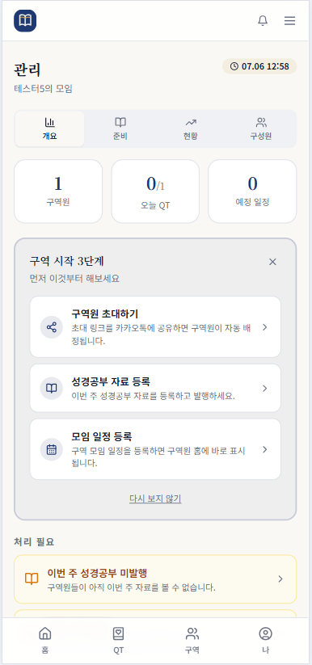
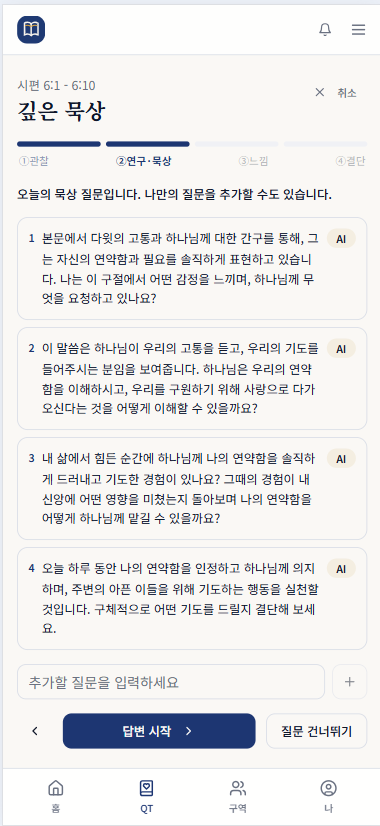

# bethel803

교회 소그룹의 QT, 기도제목, 성경읽기, 출석, 성경공부, 리더 대시보드를 하나로 묶은 **Group-First PWA**입니다.

> A group-first church small group care PWA built with React, TypeScript, Supabase, and Vercel.

bethel803은 단순한 모임 관리 앱이 아닙니다. 소그룹 리더가 구성원의 신앙 활동과 돌봄 흐름을 기억하고, 구성원은 매일의 QT, 기도, 성경읽기, 성경공부 응답을 부담 없이 남길 수 있도록 만든 실제 운영 도구입니다.

이 프로젝트는 실제 공동체 사용, 제품 설계 기록, 개인 포트폴리오를 함께 담고 있습니다. 목표는 대규모 확산보다 작은 공동체 안에서 반복 사용되는 흐름을 깊게 만들고, 그 과정의 의사결정과 개선 과정을 남기는 데 있습니다.

## Preview

| 리더 대시보드 | QT / 기도 흐름 | 성경공부 / 출석 |
| --- | --- | --- |
|  |  |  |

README 이미지는 민감정보가 제거된 샘플 화면을 사용합니다.

## Links

- **Demo**: 샘플 데이터 기반 공개 데모 준비 중
- **Service Overview**: [서비스 개요](./docs/기능설계/01_서비스개요_현재구현.md)
- **Core Features**: [핵심 기능](./docs/기능설계/02_핵심업무기능.md)
- **Data Architecture**: [데이터 아키텍처](./docs/기능설계/04_데이터_아키텍처.md)
- **Group-First Architecture**: [모임 우선 아키텍처](./docs/기능설계/모임우선_아키텍처_재설계.md)
- **Operations Guide**: [운영 가이드](./docs/OPERATIONS.md)

## Tech Stack

React · TypeScript · Vite · Tailwind CSS · shadcn-ui · TanStack Query · Supabase Auth · PostgreSQL · RLS · Storage · Edge Functions · Web Push · Vercel

## 방향

이 프로젝트의 정체성은 세 가지입니다.

- **사역**: 구역과 소그룹 안에서 서로의 삶을 기억하고 돌보는 일을 돕습니다.
- **포트폴리오**: 실사용자가 있는 제품을 직접 설계, 구축, 운영, 개선한 기록입니다.
- **동기 엔진**: 기능 수나 가입자 수보다 매일의 사용과 기록이 만드는 지속성을 중요하게 봅니다.

이 프로젝트는 매출, 가입자 규모, 확산을 목표로 삼지 않습니다. 공개 활동의 목적도 사용자 확보가 아니라 빌드로그와 의사결정 기록을 남기는 데 있습니다.

## 제품 관점

핵심 사용자는 소그룹 리더입니다.

리더는 모임 구성원의 신앙 활동과 돌봄 흐름을 한눈에 보고, 구성원은 매일의 QT와 기도, 성경읽기, 성경공부 응답을 부담 없이 남길 수 있습니다. 새 기능을 추가할 때의 기준은 “사용자가 더 자주 들어오는가”보다 “이미 함께하는 사람들이 더 깊게 연결되는가”입니다.

## 주요 기능

- **QT와 묵상 흐름**: 오늘의 QT, 기도, 완료 기록, 리더 현황 확인
- **성경공부**: 주차별 본문과 질문, 답변 저장, 관리자 준비 흐름
- **기도제목**: 개인 기도제목 등록, 응답, 중보기도 참여
- **성경읽기**: 읽기 기록, 플랜, 북마크, 통계
- **일정과 출석**: 모임 일정, 출석 응답, 첨부 관리
- **리더 대시보드**: 구성원 활동, 주간 보고, CSV 내보내기
- **알림과 검색**: 앱 내 알림, 웹푸시, 전역 검색
- **운영 자동화**: QT 수집, 주보 PDF 파싱, 주간 마감, Edge Function 기반 작업

## 아키텍처

bethel803은 멀티테넌트 구조를 갖춘 React PWA입니다.

```text
React / TypeScript / Vite
        |
TanStack Query + Supabase JS
        |
Supabase Auth / Postgres / RLS / Storage / Edge Functions
        |
Vercel + Supabase cron / Edge automation
```

핵심 설계는 **모임 우선(Group-First)** 입니다.

- 일반 사용자는 “교회 등록”보다 “모임 만들기” 흐름으로 진입합니다.
- 교회 단위 관리는 슈퍼어드민이 다루는 희소한 운영 단위로 둡니다.
- 데이터 격리는 Supabase RLS와 `church_id`, `district_id` 스코프를 기준으로 처리합니다.
- 무료 커뮤니티 모임은 공통 컨테이너 아래에 두되, 리더는 자기 모임만 보도록 제한합니다.

## 기술 스택

- React 18
- TypeScript
- Vite
- Tailwind CSS
- shadcn-ui
- TanStack Query
- Supabase Auth / PostgreSQL / RLS / Storage / Edge Functions
- Web Push / PWA
- Vercel

## 로컬 실행

```bash
npm install
npm run dev
```

기본 개발 주소:

```text
http://localhost:8080
```

`.env.example`을 참고해 `.env.local`을 만들고, 프론트에는 `VITE_` 접두사가 붙은 공개 가능한 값만 넣습니다.

```bash
VITE_SUPABASE_URL=https://your-project-ref.supabase.co
VITE_SUPABASE_ANON_KEY=your-supabase-anon-key
VITE_APP_URL=http://localhost:8080
VITE_VAPID_PUBLIC_KEY=
VITE_APP_VERSION=local-dev
```

주의:

- `service_role` 키는 프론트 환경 변수에 넣지 않습니다.
- `OPENAI_API_KEY`는 Supabase Edge Function 환경 변수로만 관리합니다.
- 운영 데이터 확인은 읽기 위주로만 수행합니다.

## 검증

```bash
npm test
npm run build
```

변경 범위가 작더라도 공개 레포 기준의 문서 위생을 확인합니다.

- 실명, 전화번호, 이메일, 비밀번호, 토큰, 제3자 UUID를 기록하지 않습니다.
- 사람은 `구성원A`, `리더A`, `테스터A`처럼 역할 가명으로 씁니다.
- 문서가 GitHub permalink로 공개되어도 괜찮은지 커밋 전에 확인합니다.

## 배포와 운영

- 프론트는 `main` 기준으로 Vercel Production에 배포합니다.
- Supabase 마이그레이션과 Edge Function은 별도 운영 절차에 따라 반영합니다.
- 자동화 작업은 Supabase Edge Function과 cron을 기준으로 관리합니다.

주요 자동화:

- `fetch-devotional`: QT 콘텐츠 수집 및 저장
- `parse-bulletin`: 주보 PDF 파싱
- `push-dispatch`: 웹푸시 발송
- `compute_weekly_report()`: 주간 보고 마감

## 문서

- [프로젝트 헌장](./CHARTER.md)
- [운영 규칙](./CLAUDE.md)
- [현재 상태](./STATE.md)
- [서비스 개요](./docs/기능설계/01_서비스개요_현재구현.md)
- [핵심 기능](./docs/기능설계/02_핵심업무기능.md)
- [데이터 아키텍처](./docs/기능설계/04_데이터_아키텍처.md)
- [모임 우선 아키텍처](./docs/기능설계/모임우선_아키텍처_재설계.md)
- [운영 가이드](./docs/OPERATIONS.md)
- [공개 레포 위생 보고서](./EXPOSURE_REPORT.md)

## 현재 상태

핵심 기능은 대부분 구현되어 있고, 현재의 우선순위는 신규 기능 확장보다 다음 항목에 있습니다.

- 기존 사용자의 사용 깊이를 보여주는 대시보드 강화
- 실제 모임 운영에서 반복 사용되는 흐름 다듬기
- PWA 안정성, 알림, 자동화 운영 품질 개선
- 빌드로그와 설계 의사결정 기록 축적

이 프로젝트는 계속 작고 구체적인 실제 사용을 기준으로 발전합니다.
